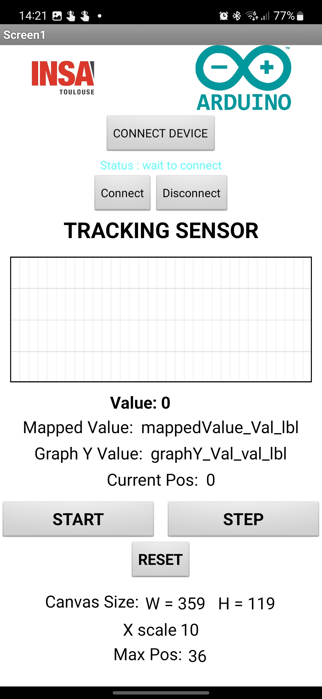

# 2022-2023-4GP-Thang-Tien

# 1. Contexte et objectifs du projet
- [x] Réaliser une jauge de contrainte low-tech à base de graphite: [Pencil Drawn Strain Gauges and Chemiresistors on Paper](https://www.researchgate.net/publication/259846610_Pencil_Drawn_Strain_Gauges_and_Chemiresistors_on_Paper)
- [x] Concevoir un shield Arduino contenant l'amplificateur du capteur et les composants électroniques annexes (émetteur/récepteur Bluetooth, encodeur rotatif et écran OLED)
- [x] Réaliser une application mobile connectée à l'émetteur Bluetooth du capteur sous APP MIT INVENTOR 
- [x] Effectuer une évaluation du capteur sur un banc d'essai afin de produire une fiche technique et de comparer la technologie utilisée avec celle d'un autre capteur commercial similaire

# 2. Capteur de contrainte
> Notre capteur de contrainte utilise une jauge en papier dotée d'un circuit résistif en graphite, qui présente l'avantage d'être facile à mettre en place à faible coût. 
> La théorie de la percolation est exploitée dans ce capteur low-tech, qui est composé de nanoparticules de graphite formant des feuillets. Le réseau percolé caractéristique de la fine couche de graphite déposée sur la feuille de papier permet le transport des électrons entre les nanoparticules par l'effet tunnel. La déformation de la jauge en tension ou en compression entraîne une variation de la résistance de la couche de graphite, ce qui permet de mesurer la contrainte et la déformation appliquées.
> Le fonctionnement de notre jauge de contrainte repose sur la variation de la résistance du circuit résistif en fonction de sa déformation. Elle est alimentée par une tension régulée de 5V fournie par une carte Arduino UNO. Le courant circulant dans la jauge est mesuré pour fournir le signal du capteur, qui doit ensuite être amplifié et filtré.
  ## 2.1. Circuit amplificateur
  > La conductance des jauges en graphite que nous utilisons est très faible (de l'ordre de la dizaine de nS) et est alimentée par une tension continue de 5V. Le circuit amplificateur du capteur doit alors être en mesure d'extraire l'information d'un signal en courant de très faible intensité.
 > Dans ce projet, nous avons décidé d'utiliser un montage transimpédance constitué d'un amplificateur opérationnel (AOP) pour fournir un signal en tension suffisant au convertisseur analogique-numérique (ADC) d'une carte Arduino UNO.
 
 >   Notre jauge de contrainte est composée d'une seule résistance en série. De ce fait, notre signal est sensible aux dérives en tension de l'amplificateur. Notre AOP doit donc avoir un offset de tension en entrée très faible de manière à ce qu'il ne puisse fausser le signal fourni à l'ADC. Cela restreint notre choix d'amplificateur opérationnel. Nos jauges de contrainte en graphite ont une conductivité aux alentours de 10 nS. La jauge étant alimentée par 5V, nous nous attendons à avoir un signal en courant de l'ordre de 50 nA. En shuntant ce courant par une résistance de 100 kΩ, le signal en tension fourni à l'AOP est de 5 mV. À titre de comparaison, l'amplificateur [LM741](https://www.ti.com/lit/ds/symlink/lm741.pdf) présente un offset en entrée typique de 1 mV, et pouvant atteindre 5 mV. Ce composant n'est donc pas adapté pour notre utilisation. Ainsi notre amplificateur doit spécifiquement présenter un offset en entrée faible. Pour cette raison, nous utilisons le [LTC1050](https://www.analog.com/media/en/technical-documentation/data-sheets/1050fb.pdf), pour sa tension de dérive de 5 µV, soit 1000 fois plus faible que notre signal nominal de 5 mV.
 
 >   À partir de cet AOP, nous élaborons l'architecture du circuit amplificateur (cf. [Figure 1a](analog_circuit_images/analog_circuit.JPG)). Ce dernier dispose de trois étages de filtrage:
 >   - à l'entrée, un filtre passe-bas (R1C1) de fréquence de coupure de 16 Hz permet de filtrer les bruits en courant sur le signal d'entrée
 >   - un autre filtre passe bas de 1.6 Hz (R3C4) couplé à l'AOP permet de filtrer la composante du bruit à 50 Hz provenant du réseau électrique
 >   - à la sortie de l'amplificateur, un dernier filtre (R5C2) de 1.6 kHz permet de traiter les bruits dus à l'échantillonage de l'ADC

 >   La capacité C3 sert à filtrer les irrégularités de la tension d'alimentation de l'amplificateur. La résistance R2 sert à calibrer l'amplificateur sur le domaine de tension souhaité, qui est celui de l'ADC du micro-contrôleur. Lors de la phase de prototypage du circuit, nous avons utilisé un potentiomètre digital à la place de cette résistance pour trouver sa valeur. Enfin, la résistance R4 protège l'AOP contre les décharges électrostatiques et constitue un filtre RC avec la capacité C1 pour les bruits en tension.

 > 

   > 
   > 

**Figure 1a - Circuit amplificateur transimpédance. La résistance *Rsensor* représente la jauge de contrainte.**
 
 > 

   > 
   > 

**Figure 1b - Simulation AC du circuit amplificateur. Les fréquences de coupure à 1.6 Hz, 16 Hz et 1.6 kHz des trois filtres en cascade sont visibles. Cette simulation permet de vérifier le fonctionnement en fréquence de notre circuit.**

> Pour vérifier le fonctionnement normal du circuit sur LTSpice, nous simulons la déformation de la jauge par un pulse de tension en entrée (Figure 2). Ce pulse de tension génère une variation du courant en entrée de l'AOP. Virtuellement, cela représente la variation de conductance de la jauge due à sa déformation. Pour cette simulation, nous faisons varier la conductance de 5 nS à 20 nS, ce qui correspond à l'ordre de grandeur des jauges resistives utilisées. Ce faisant, nous balayons à peu près tout l'intervalle de signaux d'entrée possibles:

 > 

   > 
   > 

**Figure 2 - Simulation du fonctionnement du circuit amplificateur. Un pulse de tension permet de modéliser la déformation de la jauge et la variation du signal en courant.**
 

 > 

   > 
   > 

**Figure 3: Résultats de la simulation. En vert, le signal en courant fourni par la jauge et en bleu la tension de sortie de l'AOP.**

> Sur la plage de conductance prise en compte, le signal de sortie passe d'environ 240 mV à 1.05 V, ce qui ne sature pas l'ADC. L'amplitude crête-à-crête du bruit en 50 Hz est de 14 mV RMS. Ce signal est donc détectable par l'ADC qui a une sensibilité d'environ 5 mV. Le rapport signal sur bruit est de 25.6 dB pour la plus faible conductance et de 37.2 dB pour la conductance la plus élevée. Si notre signal sur cette simulation n'est fondamentalement pas considéré comme bon en terme d'instrumentation (rapport signal sur bruit inférieur à 40 dB), remarquons que naturellement, plus le signal de sortie est élevé (i.e. plus la conductance est élevée), plus le bruit à 50 Hz est écrasé par le signal. Cela signifie que plus la conductance de la jauge est élevée, plus nos mesures seront fiables et précises. Pour cette raison, nous avons tout intérêt à utiliser des jauges de contrainte de résistance relativement faibles (autour de 50 MΩ ou moins) pour nos mesures. Pour avoir une plus grande liberté sur les conductances des jauges utilisées, nous aurions pu intégrer directement sur le PCB un potentiomètre digital à la place de R2. Cela permettrait (après une étape de calibration) d'adapter le signal de sortie à la jauge résistive utilisée pour obtenir un signal optimal. Néanmoins, si nous nous restreignons à utiliser des jauges aux conductances assez élevées, alors nous obtenons un signal tout à fait acceptable.

  ## 2.2. Intégration Arduino
   > 

   > 
   > 

 
   **Figure 4 - Design du PCB.**

   > 

   > 
   > 

   **Figure 5 - Circuit intergré des composants.** 

# 3. Programme Arduino
> Le programme Arduino permet de calculer la valeur de la résistance du capteur à partir de la valeur de tension mesurée par l'ADC de la carte. Cette mesure résistive est ensuite envoyée à l'application mobile via Bluetooth si cela est requis sur l'application. L'encodeur rotatif permet d'activer un menu sur l'OLED de choix d'affichage sur celui-ci : soit on affiche la valeur de la résistance, soit on affiche la valeur de la tension. On peut également choisir d'afficher une image ou les crédits (défilants).
> 
> A la mise en route du programme, une animation d'initialisation apparaît sur l'écran. Après cela, on a directement accès à la valeur résistive mesurée par le capteur. En tournant l'encodeur rotatoire, on peut rentrer dans le menu et sélectionner l'affichage de son choix toujours grâce à la rotation de l'encodeur. Ensuite, on valide le choix en faisant une pression sur l'encodeur.

# 4. Application mobile
> Dans le cadre de ce projet, nous avons programmé sur MIT APP INVENTOR, l'application mobile connectée au module Bluetooth du capteur. Cette dernière est constituée d'une seule activité sur laquelle il est possible d'acquérir les données du capteur en temps réel et de les tracer sur un graphique dynamique.
 > 

 > 
 > 
 > 

 **Figure 6 - page d'accueil de la dernière version de l'application mobile. Cette capture d'écran a été prise pendant le fonctionnement du capteur.**

 > Pour la connection Bluetooth, le smartphone doit être appareillé au module du capteur avant de pouvoir se connecter via l'application mobile. L'application ne permet pas de choisir à quel module se connecter. En réalité, l'application est liée à un module bluetooth en particulier (celui fourni avec le capteur) et lui seul pourra être connecté au smartphone pour la transmission de données. Une piste d'amélioration consiste à afficher la liste des dispositifs appareillés pour se connecter au module souhaité. Nous n'avons cependant pas pu implémenter cette fonctionnalité par manque de temps.

 > N.B: le fichier .apk de l'application mobile est situé dans le répertoire suivant: ....... .
# 5. Mesures : Banc de test, datasheet et discussions
  ## 5.1. Banc de test
   > 

 > 
 > 

  Nous utilisons ce banc de test composé de 7 demi cylindres de différents diamètres allant de 2 à 5 cm avec un pas de 0,5 cm. Nous posons le capteur sur chacun des cylindres et appliquons donc une déformation sur celui-ci. Cette déformation se retrouve avec la formule ci-dessous :
            $$\epsilon = \frac{e}{2r}$$
 
avec e l’épaisseur du capteur et r le rayon de courbure donc le rayon de chaque demi cylindre. Nous avons réalisé les mesures en compression et en tension pour chacun de nos capteurs.
  ## 5.2. Mesures et résultats
  On realise la test sur le capteur graphite de HB, 2H sous même tension entrée. 
  
  ## 5.3. Datasheet
  ## 5.4. Discussions
  
